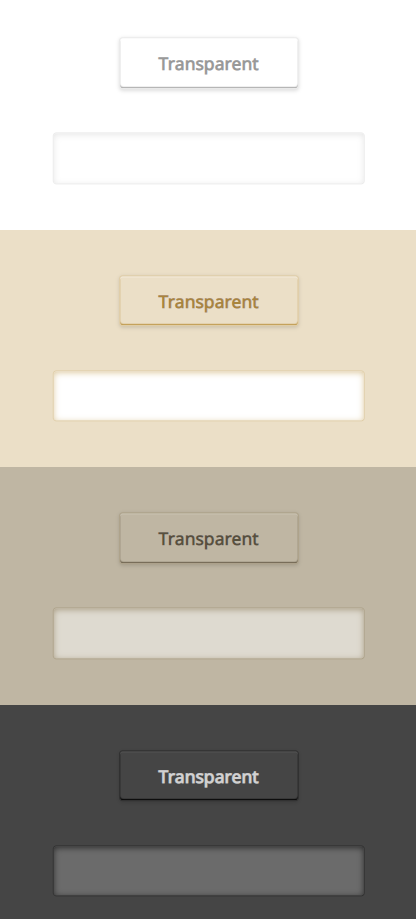

UI Kit that fits to your Interface.

## Project Idea



Project main goals:

- user-defined class names
- accessible contrast colors
- accessible for all devices
- support keyboard
- excellent UI/UX - high quality graphics
- no images
- modular without a need to use CLI configuration tools
- 100% SASS
- ease of modification

## Configuration

### Installation

Fork or download kit from GitHub. Install dependencies using:

```
$ npm i
```

From npm:

```
$ npm i keyboard-ui
```

Run example by forking this repo and run `gulp watch`

### Structure

```
.
├── dist                    # This catalog is used by npm users. `gulp build` files go here. Do not modify this other way.
├── docs                    # Documentation
├── src                     # Project source files. Development goes here.
├── patches                 # Some modules needed modifications. After running `npm i` and `gulp watch`,
|                             `gulp build` these are being applied.
├── test                    # Used for development tests
│   ├── views               # Use this to configure test html file. Run `gulp watch` to run test on localhost.
│   └── out                 # Output of `gulp watch`
└── ...
```

### Tasks

| Task         | Description                         |
| ------------ | ----------------------------------- |
| `gulp watch` | Test project on localhost           |
| `gulp build` | Compile files into `./dist` catalog |

## Contribute

This UI KIt is made by community and for community. If you want to help develop this project you can do it by:

[Report a bug](https://github.com/KeyboardUI/Keyboard_UI/issues)

[Ask for a feature](https://github.com/KeyboardUI/Keyboard_UI/issues)

[Submit a pull request](https://github.com/KeyboardUI/Keyboard_UI/pulls)
