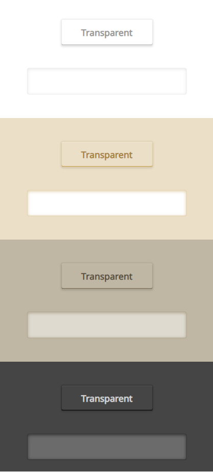

UI Kit that fits to your Interface.

## Project Idea



This project aims at creating UI Kit that will adjust to user's interface.

## Configuration

### Installation

Fork or download kit from GitHub. Install dependencies using:

```
$ npm i
```

<b><i>HTML TAG TEST</i></b>

View example `.html` files inside `./test/out` catalog.

### Structure

```
.
├── css                     # Compiled sass files
├── js
├── js                      # Project source files
├── test                    # Used for development tests
│   ├── views               # Use this to configure test html file. Run gulp test to build project.
│   └── out                 # views output
└── ...
```

### Tasks

| Task        | Description                                                                         |
| ----------- | ----------------------------------------------------------------------------------- |
| `gulp sass` | Compile sass files into `./css` folder                                              |
| `gulp pug`  | Compile pug files into `./test/out` folder                                          |
| `gulp test` | Compile test pug sass files into `./test/out` folder. **Use this for development.** |

## Contribute

This UI KIt is made by community and for community. If you want to help develop this project you can do it by:

[Report a bug](https://github.com/wisniewski94/Keyboard_UI/issues)

[Ask for a feature](https://github.com/wisniewski94/Keyboard_UI/issues)

[Submit a pull request](https://github.com/wisniewski94/Keyboard_UI/pulls)
